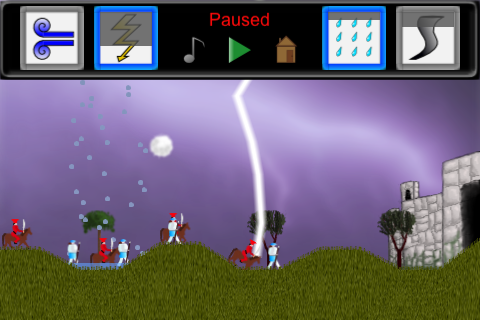

## God of Thunder - an iOS tower defence game
  

### Info
*God of Thunder* is an iOS App store game for the 1st generation iPod and higher.  
[Website](https://sites.google.com/site/thebreakgames/home/god-of-thunder)
### Gameplay description
Don't let the Conquistadors capture Incan cities! Even if one of them reaches city gates, the battle will be lost! As an Incan God of Thunder, defend your land using only the power of nature, such as Lightning, Wind, Water, Tornado and even Fire. Play through levels of intense gameplay and restore peace in this land! Requirements:
- Strategic thinking;
- Ability to make quick decisions;
- Good eye-hand coordination.  
### Technologies
Developed using Objective-C programming language and powered by *Cocos2d* rendering engine.
### Author
Designed and developed by [Ivars Rusbergs](https://github.com/ivarsrb)  
Copyright © 2011 Ivars Rusbergs